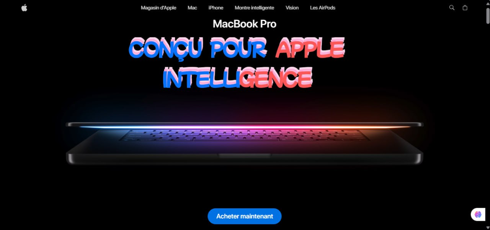

# 3DSpot - Découvrez le MacBook Pro en 3D

<div align="center">
  
  
  <h1>💻 3DSpot - Votre Visualiseur 3D du MacBook Pro</h1>
  
  [](https://opensource.org/licenses/MIT)
  [](https://reactjs.org/)
  [](https://vitejs.dev/)
  [](https://tailwindcss.com/)
  [](https://greensock.com/gsap/)
  [](https://react-three-fiber.js.org/)
  [](https://www.npmjs.com/package/react-responsive)
  
  _Explorez le MacBook Pro comme jamais auparavant avec une expérience 3D immersive_
  _Découvrez les fonctionnalités innovantes d'Apple dans un environnement interactif et visuellement époustouflant_
</div>

## 🌟 Présentation de 3DSpot

3DSpot est un site web moderne et immersif dédié à la présentation du MacBook Pro d'Apple. Ce projet utilise des technologies 3D avancées pour offrir une expérience utilisateur unique, permettant aux visiteurs d'explorer les détails du produit, ses fonctionnalités et ses performances à travers des animations fluides et des visualisations interactives.

## ✨ Fonctionnalités

### 🎯 Navigation et Structure

- **Barre de navigation** : Animée au défilement avec des liens vers les sections principales (Apple Store, Mac, iPhone, etc.)
- **Structure modulaire** : Données centralisées pour une gestion simplifiée (fonctionnalités, images, vidéos, etc.)
- **Navigation fluide** : Transitions élégantes entre les sections pour une expérience utilisateur optimale

### 🎥 Expérience Immersive

- **Section Héros** : Vidéo synchronisée au défilement pour une présentation dynamique du MacBook Pro
- **Adaptabilité** : Design réactif optimisé pour mobile et desktop
- **Animations avancées** : Effets de parallaxe, fondus et transitions fluides
- **Chargement intelligent** : Médias chargés uniquement lorsqu'ils sont visibles pour des performances optimales

### 💻 Visualiseur de Produit 3D

- **Modèles 3D interactifs** : Explorez le MacBook Pro en 14" et 16" avec des contrôles de couleur et d'échelle
- **Animations de rotation** : Modèle 3D qui tourne automatiquement pour une vue complète
- **Sélection de couleurs** : Changez la couleur du MacBook (Gris Sidéral, etc.) en temps réel
- **Écrans vidéo intégrés** : Démos de fonctionnalités Apple directement sur l'écran du modèle 3D

### 🚀 Showcase et Performances

- **Section Showcase** : Présentation des puces M4 et d'Apple Intelligence avec animations au défilement
- **Comparaisons de performances** : Mise en avant des gains en vitesse et en efficacité
- **Contenu éducatif** : Explications détaillées des innovations technologiques

### 🎨 Fonctionnalités Avancées

- **Section Features** : Exploration des outils IA, écrans et autres innovations avec synchronisation vidéo
- **Highlights** : Points forts du produit (autonomie, écran, performances) avec animations
- **Performance** : Démonstration des capacités graphiques avec images positionnées dynamiquement

### 📱 Design Réactif et Accessibilité

- **Mobile-first** : Interface adaptée à tous les appareils
- **Animations conditionnelles** : Effets désactivés sur mobile pour des performances optimales
- **Accessibilité** : Support ARIA et navigation au clavier

## 🚀 Technologies Utilisées

### Frontend

- **Framework** : [React 19.1.1](https://react.dev/) avec [Vite 7.1.7](https://vitejs.dev/)
- **Styling** : [Tailwind CSS 4.1.14](https://tailwindcss.com/) pour un design moderne et réactif
- **Animations** : [GSAP 3.13.0](https://greensock.com/gsap/) avec [@gsap/react 2.1.2](https://gsap.com/resources/React/) pour des effets fluides
- **3D Rendering** : [React Three Fiber 8.15.19](https://react-three-fiber.js.org/) avec [@react-three/drei](https://github.com/pmndrs/drei) pour les modèles 3D
- **Responsive** : [React Responsive 10.0.1](https://www.npmjs.com/package/react-responsive) pour les requêtes média
- **Gestion d'État** : Zustand pour la gestion des couleurs et échelles du modèle 3D
- **Optimisation** : Code splitting, chargement paresseux et compression des assets
- **Accessibilité** : Support ARIA et navigation au clavier complète

### Outils Supplémentaires

- **Modèles 3D** : Fichiers GLB pour les MacBook Pro (14" et 16")
- **Vidéos et Images** : Assets optimisés pour les performances

## ⚙️ Configuration & Installation

### Prérequis

- Node.js 16+ (recommandé : LTS)
- npm ou yarn
- Un navigateur moderne supportant WebGL pour les fonctionnalités 3D

### Installation des Dépendances

```bash
# Installer les dépendances principales
npm install react @react-three/fiber @react-three/drei gsap @gsap/react react-responsive zustand clsx

# Installer Tailwind CSS
npm install -D tailwindcss @tailwindcss/vite
```

### Scripts Utiles pour Configuration Rapide
Voici une séquence de commandes pour initialiser et configurer rapidement le projet :

```bash
# Créer un nouveau projet Vite avec React
npm create vite@latest ./

# Installer Tailwind CSS
npm install -D tailwindcss @tailwindcss/vite

# Initialiser Git
git init
git add .
git commit -m 'commit initial'
git branch -M main
git remote add origin https://github.com/KemogneAlex/3DSpot.git
git push -u origin main

# Installer les dépendances principales
npm i zustand clsx
npm i three @react-three/drei @react-three/fiber

# Convertir le modèle GLB en composant React (si nécessaire)
npx gltfjsx macbook-14.glb -T

# Installer GSAP et React Responsive
npm i gsap @gsap/react
npm i react-responsive

# Construire le projet pour la production
npm run build
```

### Instructions d'Installation

1. **Cloner le dépôt**

   ```bash
   git clone https://github.com/KemogneAlex/3DSpot.git
   cd 3DSpot
   ```

2. **Installer les dépendances**

   ```bash
   npm install
   # ou
   yarn install
   ```

3. **Lancer l'environnement de développement**

   ```bash
   npm run dev
   # ou
   yarn dev
   ```

4. **Ouvrir dans le navigateur**
   L'application sera disponible à l'adresse : [http://localhost:5173](http://localhost:5173)
   
   **Site déployé** : [https://spot3d.kemogne-malone.fr/](https://spot3d.kemogne-malone.fr/)

### Liens Utiles

- 📚 [Documentation GSAP](https://gsap.com/docs/v3/)
- 🎨 [Guide Tailwind CSS avec Vite](https://tailwindcss.com/docs/installation/using-vite)
- 🛠️ [React Three Fiber Docs](https://react-three-fiber.js.org/)
- 💻 [Zustand pour la gestion d'état](https://zustand-demo.pmnd.rs/)

## 🏗️ Structure du Projet

```
3DSpot/
├── public/             # Fichiers statiques (images, modèles 3D, vidéos)
│   ├── image.jpg       # Image d'accueil pour le README
│   ├── logo.svg        # Logo Apple
│   └── ...             # Autres assets
├── src/
│   ├── assets/         # Ressources supplémentaires
│   ├── components/     # Composants React
│   │   ├── App.jsx     # Composant racine
│   │   ├── NavBar.jsx  # Barre de navigation
│   │   ├── Hero.jsx    # Section héros avec vidéo
│   │   ├── ProductViewer.jsx # Visualiseur 3D du produit
│   │   ├── Showcase.jsx # Présentation des puces M4
│   │   ├── Performance.jsx # Section performances graphiques
│   │   ├── Features.jsx # Fonctionnalités avec modèles 3D
│   │   ├── Highlights.jsx # Points forts du produit
│   │   ├── Footer.jsx  # Pied de page avec crédits
│   │   ├── three/      # Composants 3D (lumières, modèles)
│   │   └── models/     # Modèles 3D du MacBook
│   ├── constants/      # Données centralisées (index.js)
│   ├── store/          # Gestion d'état (Zustand)
│   └── main.jsx        # Point d'entrée
├── index.html
├── package.json
├── README.md
├── tailwind.config.js
└── vite.config.js
```

## 📱 Compatibilité

- Navigateurs modernes (Chrome, Firefox, Safari, Edge) supportant WebGL
- Mobile-first design avec adaptations pour écrans tactiles
- Compatible avec les dernières versions des navigateurs mobiles

## 📄 Licence

Ce projet est sous licence MIT.

## ✉️ Contact

Pour toute question ou suggestion, n'hésitez pas à me contacter à [kemognemalone@gmail.com](mailto:kemognemalone@gmail.com).

---

<div align="center">
  <p>Développé avec ❤️ par Kemogne Alex</p>
  <p>© 2025 3DSpot - Tous droits réservés</p>
</div>
